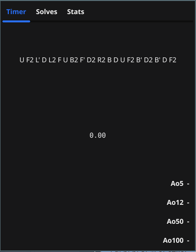
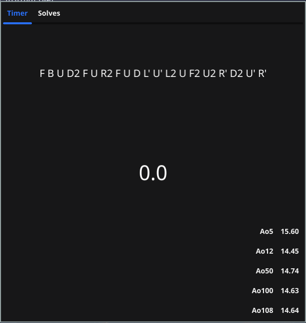

# GoTimer (Cube timer)
A very lightweight 3x3x3 cube timer written in Go and built with Fyne GUI toolkit
### Current features
- Generate scrambles 
- Save times with their scramble
- Calculate average from last 5/12/50/100 solves excluding best and worst time
### Notes
- This is in a very early state, don't expect many features!
- Don't compile this if using Windows, use the release binaries instead. There are some changes made to the release binary that makes the timer work correctly in Windows
- Scrambles are generated using  project 
# Screenshots

