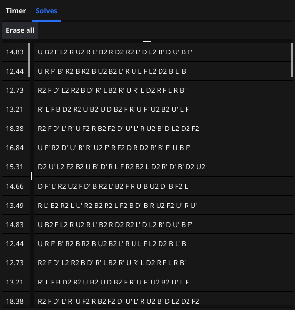

# GoTimer (Cube timer)
A very lightweight 3x3x3 cube timer written in Go using the Fyne GUI toolkit
### Current features
- Generate scrambles 
- Save times with their scramble
- Calculate average from last 5/12/50/100 and current amount of saved solves excluding best and worst time
- Delete saved times individually
### Notes
- This is in a very early state, don't expect many features!
- Scrambles are generated using  project 
# Screenshots

