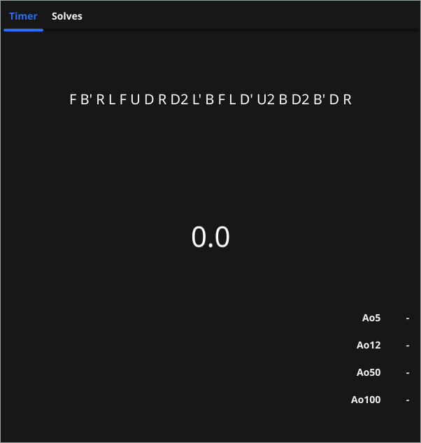

# GoTimer (Cube timer)
A very lightweight 3x3x3 cube timer written in Go and built with Fyne GUI toolkit
### Current features
- Calculate average from last 5/12/50/100 solves
- Generate new scrambles once solve has finished
### Note
This is in a very early state, don't expect many features!
# Screenshots

